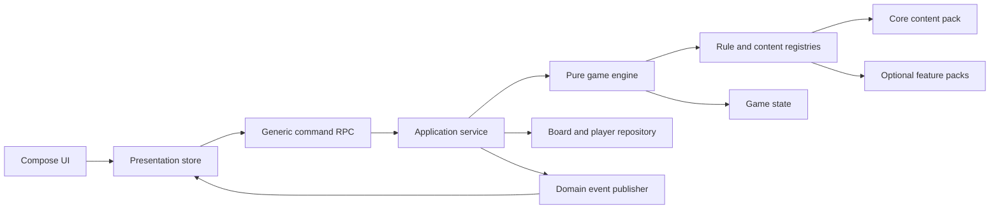

# План архітектурного рефакторингу

## Статус документа

Це цільова архітектура й план міграції, а не опис уже реалізованого стану. Рефакторинг має виконуватися інкрементально: кожна фаза завершується працездатною грою, підтримує старі партії та має власні критерії готовності.

## Мета

Після рефакторингу проєкт повинен дозволяти:

- додати новий екземпляр картки без змін Kotlin-коду;
- скласти новий вид картки з наявних ефектів декларативно;
- додати принципово нову механіку картки одним handler’ом і одним UI renderer’ом;
- додати тип клітинки без редагування центрального серверного `when`;
- додати третє або наступне коло конфігурацією треку, а не новою гілкою в кожному шарі;
- незалежно підключати тематичні набори контенту;
- версіонувати правила й мігрувати збережені партії;
- тестувати правила без RPC, бази даних, Compose та затримок.

## Проблеми поточної моделі

### Тип одночасно є даними, поведінкою та UI-диспетчером

`PlaceType`, `BoardCard` і `BoardCardType` використовуються як серіалізований контракт, ключ серверної логіки, ключ генератора та ключ UI. Тому новий підтип створює каскад exhaustive `when` у всіх модулях.

### Серверний сервіс є і транспортом, і рушієм

`RaceRatServiceImpl` одночасно реалізує RPC, авторизацію ходу, доменні правила, транзакції зберігання, генерацію подій і оркестрацію UI-сценаріїв. Його важко тестувати ізольовано й небезпечно розширювати паралельними функціями.

### Кола закриті enum’ом

`BoardLayer` містить лише `INNER` та `OUTER`. Невідомий level повертає `INNER`, що приховує помилки. Розкладка, камера й умови переходу також знають рівно два треки.

### RPC росте разом із контентом

Для багатьох карткових дій існує окремий метод: `buyCorruptLand`, `sellCorruptBusiness`, `passEstate`, `reelection` тощо. Додавання механіки змінює спільний RPC-інтерфейс, сервер, клієнтський view model і тестові заглушки.

### Дублювання домену

Локальний режим має власні фінансові моделі й формули. Виправлення або новий параметр балансу легко додати в онлайн-режим і забути в локальному.

## Архітектурні принципи

1. **Сервер лишається авторитетним.** Клієнтські перевірки потрібні для UX, але не замінюють серверну валідацію.
2. **Чисте доменне ядро.** Одна команда плюс незмінний стан дають новий стан і список доменних подій без I/O.
3. **Стабільні рядкові ID.** Типи контенту не залежать від ordinal enum або номера sealed-підкласу.
4. **Композиція перед наслідуванням.** Типові картки й клітинки складаються з ефектів; новий Kotlin-тип потрібен лише для нової поведінки.
5. **Реєстрація замість центрального `when`.** Feature-модуль реєструє definition, handler, validator і renderer.
6. **DTO відокремлені від runtime-об’єктів.** Серіалізовані дані не містять функцій, а runtime registry не зберігається в базі.
7. **Версія правил фіксується в партії.** Оновлення сервера не повинно непомітно змінювати вже створену дошку.
8. **Невідомий контент не має мовчки перетворюватися на інший.** Завантаження повинно дати явну помилку сумісності або безпечний read-only режим.

## Цільова схема



### Запропоновані модулі

Перший етап може використовувати пакети в наявних Gradle-модулях. Фізичне рознесення доцільне після стабілізації API.

| Модуль | Вміст |
|---|---|
| `game-contract` або оновлений `shared` | Стабільні DTO команд, подій, snapshot, ID, schema version. Без Compose, БД і серверних handler’ів. |
| `game-engine` | Чисті редюсери, правила руху, платежі, черга, ефекти, реєстри та інваріанти. KMP common. |
| `game-content-core` | Поточні клітинки, колоди, ефекти, дефолтний баланс і міграційні aliases. |
| `game-feature-*` | Необов’язкові набори: депутати/корупція, сім’я, інвестиції, додаткові треки тощо. |
| `server` | RPC adapter, транзакції, repository, event transport, генерація й DI реєстрів. |
| `board` | Presentation state, generic interaction UI та реєстр спеціалізованих renderer’ів. |
| `card` | Локальний adapter до спільної фінансової моделі; без дубльованих формул. |

## Цільова доменна модель

### Стабільні ID

```kotlin
@Serializable
@JvmInline value class TrackId(val value: String)

@Serializable
@JvmInline value class CellTypeId(val value: String)

@Serializable
@JvmInline value class DeckId(val value: String)

@Serializable
@JvmInline value class CardKindId(val value: String)
```

Рекомендований формат: `core.salary`, `core.market`, `corruption.tax_inspection`. Префікс запобігає конфліктам між feature-пакетами.

### Дошка з довільними треками

```kotlin
@Serializable
data class BoardDefinition(
    val id: String,
    val rulesVersion: Int,
    val tracks: List<TrackDefinition>,
    val decks: Map<DeckId, DeckDefinition>,
    val transitions: List<TrackTransitionDefinition>,
)

@Serializable
data class TrackDefinition(
    val id: TrackId,
    val order: Int,
    val topology: TrackTopology,
    val cells: List<CellInstance>,
    val visual: TrackVisualHint,
)

@Serializable
data class CellInstance(
    val id: String,
    val type: CellTypeId,
    val parameters: JsonObject = JsonObject(emptyMap()),
)
```

`PlayerLocation` зберігає `trackId` і `cellIndex`, а не числовий level. Порядок прогресії задається `transitions`; він може бути лінійним, розгалуженим або мати кілька входів. Кількість треків не обмежена.

`TrackTopology` на першому етапі підтримує `LOOP`, згодом може додати `PATH` або `GRAPH`. `TrackVisualHint` описує бажану форму, але не містить dp-координат.

### Реєстр клітинок

```kotlin
interface CellRule {
    val type: CellTypeId
    fun validate(parameters: JsonObject): ValidationResult
    fun onLand(context: TurnContext, cell: CellInstance): RuleResult
    fun onPass(context: TurnContext, cell: CellInstance): RuleResult = RuleResult.noChange()
}
```

`CellRuleRegistry` збирається DI-контейнером. Нова клітинка додає реалізацію правила й реєстрацію у своєму feature-модулі. Центральний рушій знає лише фази `onPass` та `onLand`.

### Декларативні картки

```kotlin
@Serializable
data class CardDefinition(
    val id: String,
    val deckId: DeckId,
    val kind: CardKindId,
    val availability: AvailabilityRule = AvailabilityRule.Always,
    val presentation: CardPresentation,
    val interactions: List<InteractionSpec>,
    val effects: List<EffectSpec>,
)
```

Більшість наявних карток описуються композицією стандартних ефектів:

- `ChangeCash`;
- `PayAmount`;
- `AcquireAsset`;
- `RemoveAsset`;
- `ChangeRecurringIncome`;
- `ChangeRecurringExpense`;
- `OfferPurchase`;
- `OfferSale`;
- `RequirePlayerPredicate`;
- `RequireResource`;
- `SpendResource`;
- `DrawCard`;
- `StartAuction`;
- `ForEachEligiblePlayer`;
- `SetCounter`;
- `EmitNotice`;
- `EndTurn`.

Новий контент на кшталт «продай дві акції й отримай бонус» складається з наявних effect specs. Якщо з’являється принципово новий ефект, feature-модуль додає `EffectHandler` за стабільним `EffectTypeId`.

### Дії користувача

Замість RPC-методу на кожен сценарій потрібна одна версіонована команда:

```kotlin
@Serializable
data class GameCommandEnvelope(
    val commandId: String,
    val boardId: String,
    val playerId: String,
    val expectedRevision: Long,
    val command: GameCommand,
)

@Serializable
sealed interface GameCommand {
    data class RollDice(val nonce: String) : GameCommand
    data class ChooseInteraction(
        val interactionId: String,
        val input: JsonObject,
    ) : GameCommand
    data class EndTurn(val reason: String) : GameCommand
}
```

Для простого UI сервер повертає `PendingInteraction` із заголовком, полями, межами суми, швидкими значеннями та доступними варіантами. Клієнт має універсальні renderer’и форм, а складні механіки можуть зареєструвати спеціалізований renderer за `interactionKind`.

`expectedRevision` захищає від подвійного натискання та застарілих команд. `commandId` забезпечує ідемпотентність повтору після reconnect.

### Результат чистого рушія

```kotlin
data class RuleResult(
    val state: GameState,
    val events: List<DomainEvent>,
    val pendingInteractions: List<PendingInteraction>,
)
```

Рушій не викликає Storage, RPC, звук або Compose. Application service завантажує snapshot, виконує команду, атомарно зберігає нову revision і публікує події після успішного commit.

## Розширення після рефакторингу

### Нова клітинка

Приклад: `insurance.audit`.

1. Оголосити стабільний `CellTypeId` і JSON schema параметрів.
2. Реалізувати `CellRule` або скласти клітинку з наявних ефектів.
3. Зареєструвати presentation descriptor: локалізацію, семантичний колір, іконку та звук.
4. Додати `CellInstance` у потрібний `TrackDefinition`.
5. Додати contract test handler’а й render test descriptor’а.

Центральний engine, RPC і геометрія не змінюються.

### Новий вид картки

Приклад: картка ринку «обміняти землю на частку бізнесу».

1. Якщо механіка виражається наявними `InteractionSpec` і `EffectSpec`, додати лише definition та локалізований текст.
2. Якщо потрібен новий ефект, додати один `EffectHandler` у feature-модуль.
3. Спеціалізований Compose renderer потрібен лише тоді, коли generic form не може коректно показати взаємодію.
4. Додати availability rule для дозволених треків або станів.

`BoardCard`, `RaceRatService` і `BoardViewModel` не отримують нових підтипів або методів.

### Додатковий рівень кола

Приклад: третє коло `elite`.

1. Додати `TrackDefinition(id = "elite", ...)` із довільною кількістю клітинок.
2. Додати перехід `outer → elite` з декларативною умовою.
3. Надати `TrackVisualHint`; універсальний layout обчислить вкладені треки.
4. За потреби додати нові колоди або availability rules `OnlyTracks(setOf("elite"))`.
5. Додати умови завершення або наступний перехід.

Модель гравця, рух, debug navigation і камера працюють зі списком треків, а не з `when (INNER/OUTER)`.

## План міграції

### Фаза 0. Захисна сітка

Статус: виконано. Матриця покриття та команда перевірки наведені в [PHASE_0_SAFETY_NET.md](PHASE_0_SAFETY_NET.md).

Мета — зафіксувати фактичну поведінку до структурних змін.

- Додати characterization tests для кожної клітинки й кожного механічного варіанта картки.
- Окремо перевірити чергу, пропуски, refill колод, багатокористувацькі ринкові події, аукціон, кредитний ліміт і перемогу.
- Зафіксувати серверні інваріанти добровільної купівлі, доступного кредиту й `businessLimit`, які зараз частково покладаються на клієнтський UI.
- Додати golden fixtures серіалізації поточного `Board`, `Player`, карток і подій.
- Зафіксувати `rulesVersion = 1` для поточного формату.
- Винести генератор випадковості за інтерфейс, щоб тести керували кубиком і випадковим вибором.

Критерій готовності: всі правила з `GAME_RULES.md`, `BOARD_CELLS.md` і `CARDS.md` мають серверний тест; старі JSON fixtures завантажуються.

### Фаза 1. Чисті фінанси й спільний домен

- Винести `MoneyService`/`PaymentPolicy`, cash flow, total, активи та recent changes у KMP `game-engine`.
- Прибрати залежність доменних операцій від `eventBus` і `board()`; повертати domain events у результаті.
- Перевести локальний `card` на спільні value objects і формули через adapter, зберігши міграцію старого KStore JSON.
- Додати `GameRandom` і `GameClock` як залежності.

Критерій готовності: онлайн і локальний режим використовують одну реалізацію базових фінансових формул; UI і RPC не змінюють поведінку.

### Фаза 2. Application service навколо рушія

- Створити `GameEngine.execute(snapshot, command)` без I/O.
- Винести repository interface і транзакційний application service із `RaceRatServiceImpl`.
- Додати revision, command ID та ідемпотентне виконання.
- Старі RPC-методи тимчасово перетворити на adapter’и до команд рушія.
- Розділити domain events і presentation notices.

Критерій готовності: основний сценарій повного ходу тестується без Ktor і Storage; старі клієнти продовжують працювати.

### Фаза 3. Реєстр клітинок

- Ввести `CellTypeId`, `CellInstance`, `CellRuleRegistry` і `onPass/onLand` pipeline.
- Обгорнути кожен поточний `PlaceType` adapter’ом до нового handler’а.
- Перенести серверний `when` у незалежні правила клітинок.
- Додати presentation registry для іконки, кольору, назви та звуку.
- Перевести генерацію layout на definitions.

Критерій готовності: тестова клітинка з окремого модуля підключається реєстрацією без зміни engine, RPC та центрального UI-dispatcher.

### Фаза 4. Декларативні картки й generic interaction

- Ввести `DeckId`, `CardKindId`, `CardDefinition`, availability rules, interactions та effect specs.
- Спочатку мігрувати прості картки: бізнес, покупки, підробіток і витрати.
- Потім мігрувати активи, аукціон і багатокористувацькі ринкові події.
- Останніми мігрувати депутатів, корупцію й перевибори.
- Додати generic `ChooseInteraction` RPC та renderer стандартних purchase/sell/amount/choice форм.
- Залишити adapter старих `BoardCard` до завершення міграції збережень.

Критерій готовності: нова картка, складена лише з відомих ефектів, додається JSON/Kotlin definition без змін transport або view model.

### Фаза 5. Динамічні треки

- Замінити `BoardLayer` на `TrackId` у runtime-моделі.
- Додати міграцію `level 0 → inner`, `level 1 → outer`.
- Перенести умови виходу й перемоги в transitions/objectives.
- Побудувати універсальний `TrackLayoutEngine`, який приймає список topology + visual hints.
- Перевести камеру, LOD, фішки, debug UI та генератор на довільну кількість треків.
- Видалити fallback невідомого level до `INNER`; невідомий track ID має бути помилкою сумісності.

Критерій готовності: автоматичний тест створює партію з трьома колами різної довжини, проходить два переходи, робить повний оберт на кожному й коректно рендерить усі треки у portrait, landscape та Wasm.

### Фаза 6. Feature-пакети й стабілізація API

- Рознести core content, family, investments, deputies/corruption та dreams у feature-пакети.
- Додати manifest із `featureId`, версією, залежностями, definitions і migrations.
- При створенні дошки зберігати точний список feature versions.
- Додати перевірку відсутніх handler’ів до відкриття партії.
- Видалити застарілі RPC-методи, sealed adapters і дубльовані моделі після завершення періоду сумісності.

Критерій готовності: сервер може запустити core-only гру без корупційного feature, а клієнт показує коректний набір колод, клітинок і UI без умовних гілок у центральних екранах.

## Версіонування і міграції

Кожен snapshot повинен містити:

```text
schemaVersion
rulesVersion
contentPackVersions
revision
```

- `schemaVersion` змінюється при зміні форми JSON.
- `rulesVersion` змінюється при зміні семантики наявної механіки.
- `contentPackVersions` фіксують конкретний набір definitions.
- `revision` зростає після кожної прийнятої команди.

Міграції є послідовними чистими функціями `vN → vN+1` із golden tests. Не можна переписувати старий snapshot «на місці» без резервної копії. Довгі активні партії або продовжують працювати на зафіксованій версії правил, або проходять явну підтверджену міграцію.

## Тестова стратегія

| Рівень | Що перевіряє |
|---|---|
| Unit | Один handler клітинки/ефекту, формули, predicates, transition guards. |
| Contract | Кожен зареєстрований definition має handler, валідну schema, локалізацію й presentation descriptor. |
| Scenario | Команди кількох гравців від початку ходу до наступної черги. |
| Property | Гроші не з’являються поза визначеними ефектами; позиція завжди в межах треку; revision монотонна. |
| Serialization | Старі fixtures мігруються; новий snapshot стабільно round-trip серіалізується. |
| UI render | Generic interactions і спеціалізовані renderer’и на мінімальних розмірах та Wasm. |
| Compatibility | Старий RPC adapter дає той самий результат, що й нова команда. |

Для кожного feature-пакета потрібен автоматичний contract suite. Він має падати при дубльованому ID, відсутньому handler’і, невідомому ефекті, невалідних параметрах, відсутній локалі або недоступному renderer’і.

## Спостережуваність

Application service має логувати структуровано:

- `boardId`, `commandId`, `playerId`, `revisionBefore`, `revisionAfter`;
- тип команди й відхилення без приватного тексту;
- ID виконаних правил і ефектів;
- тривалість завантаження, engine execution, commit і publish;
- версії schema, rules і feature-пакетів.

Domain events можуть утворити аудит партії, але snapshot лишається основним джерелом відновлення на першому етапі. Повний event sourcing не є передумовою цього рефакторингу.

## Ризики та запобіжники

| Ризик | Запобіжник |
|---|---|
| Надто універсальний JSON послабить типобезпечність | Валідувати parameters schema під час завантаження; усередині handler перетворювати JSON у typed config. |
| Одночасний rewrite зламає активні партії | Strangler migration: старі DTO й RPC працюють через adapter до завершення кожної фази. |
| Generic UI стане незручним | Покрити 80% стандартними interactions, залишити registry спеціалізованих renderer’ів. |
| Feature без клієнтського renderer’а прийде на сервер | Capability handshake і перевірка manifests перед приєднанням. |
| Різні версії правил дадуть різний результат | Фіксувати rules/content versions у Board і не використовувати глобальний «latest» для активної партії. |
| Динамічні треки ускладнять Wasm layout | Спочатку підтримати лише циклічну прямокутну topology; додавати інші форми окремими layout strategies. |

## Що не входить у першу ітерацію

- завантаження неперевіреного коду плагінів під час роботи сервера;
- повний event sourcing;
- довільний граф руху до стабілізації циклічних треків;
- редактор контенту для кінцевого користувача;
- одночасна зміна правил, дизайну й мережевого протоколу без compatibility adapters.

## Порядок практичного виконання

Рекомендований перший інкремент: Фаза 0 → чистий `PaymentPolicy` з Фази 1 → одна проста клітинка (`Salary`) через новий engine adapter → одна проста картка (`RandomJob`) через effect spec. Це перевірить усі ключові межі на малому обсязі до міграції складних ринкових і корупційних сценаріїв.

Рефакторинг вважається завершеним, коли три демонстраційні розширення проходять без змін центрального коду:

1. нова клітинка з унікальним правилом;
2. новий вид картки, складений із наявних ефектів;
3. третє коло з власним переходом і колодою.
